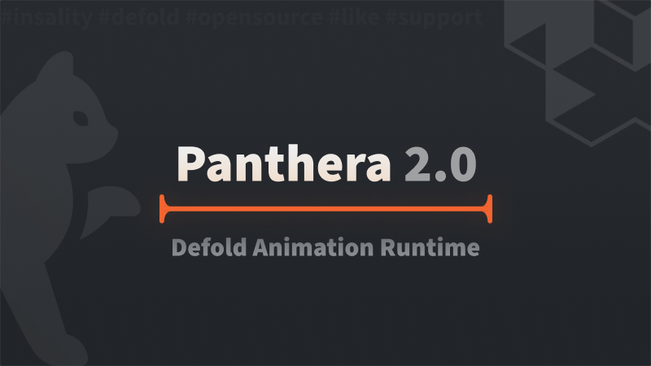

[](https://github.com/sponsors/insality) [](https://ko-fi.com/insality) [](https://www.buymeacoffee.com/insality)

[](https://github.com/Insality/panthera/tags)

# Panthera Runtime

**Panthera Runtime** - a [Defold](https://defold.com/) library designed to integrate animations created with [**Panthera 2.0 Editor**](/docs_editor/README.md), a versatile animation software, into Defold projects. This runtime library simplifies the process of importing and playing back Panthera animations, enhancing the visual quality and interactivity of Defold games and applications.

## Features

- **Seamless Animation Integration**: Import and use Panthera 2.0 animations directly in Defold.
- **Full Animation Support**: Supports all animation features provided by Panthera 2.0, including events, animation blending, nested animations and more.
- **Flexible Usage**: Compatible with both game objects and GUI nodes in Defold, allowing for versatile application across different game elements.
- **Animation Cursor**: Provides a way to control animation manually, allowing for precise control over playback and synchronization with game events.
- **Hot Reloading**: Reload animations on the fly during development, enabling rapid iteration and testing of animation assets.

## Panthera 2.0 Editor

Read the [**Panthera 2.0 Editor**](/docs_editor/README.md) guide to learn about the Panthera 2.0 Editor, an innovative tool developed using the Defold engine, designed to simplify and enhance the creation of animations for Defold projects.

## Setup

### [Dependency](https://defold.com/manuals/libraries/#setting-up-library-dependencies)

Open your `game.project` file and add the following lines to the dependencies field under the project section:


**[Defold Tweener](https://github.com/Insality/defold-tweener)**

```
https://github.com/Insality/defold-tweener/archive/refs/tags/2.zip
```

**[Panthera Runtime](https://github.com/Insality/panthera)**

```
https://github.com/Insality/panthera/archive/refs/tags/runtime.2.zip
```

After that, select `Project ▸ Fetch Libraries` to update [library dependencies]((https://defold.com/manuals/libraries/#setting-up-library-dependencies)). This happens automatically whenever you open a project so you will only need to do this if the dependencies change without re-opening the project.

### Library Size

> **Note:** The library size is calculated based on the build report per platform

| Platform         | Library Size |
| ---------------- | ------------ |
| HTML5            | **11.51 KB** |
| Desktop / Mobile | **19.53 KB** |


### Hot Reloading Animations for Development

Panthera Runtime supports hot reloading of animations for a more efficient development workflow. This feature allows animations to be reloaded automatically without restarting your Defold game, facilitating rapid iteration on animation assets.

To enable hot reloading of animations, include the following settings in your `game.project` file:

```ini
[panthera]
hotreload_animations = 1
```

**Configuration Details:**

- **hotreload_animations**: Set to `1` to enable hot reloading. This feature is active only in debug mode.

**Implementing Hot Reload in Defold:**

To utilize hot reloading, set up a window event listener in your Defold script that triggers `panthera.reload_animation()` when the game window gains focus. This ensures that animations are refreshed automatically during development:

```lua
local panthera = require("panthera.panthera")

-- Reload animation when window is focused, only for debug and on desktop
window.set_listener(function(_, event)
    if event == window.WINDOW_EVENT_FOCUS_GAINED then
        panthera.reload_animation()
    end
end)
```

> **Note:** Hot reloading is designed for use in development environments only.


## API Reference

### Quick API Reference

```lua
panthera.create_gui(animation_path, [get_node])
panthera.create_go(animation_path, [get_node])
panthera.create(animation_path, adapter, [get_node])
panthera.clone_state(animation_state)
panthera.play(animation_state, animation_id, [options])
panthera.stop(animation_state)
panthera.set_time(animation_state, animation_id, time)
panthera.get_time(animation_state)
panthera.get_duration(animation_state, animation_id)
panthera.is_playing(animation_state)
panthera.get_latest_animation_id(animation_state)
panthera.set_logger([logger_instance])
panthera.reload_animation([animation_path])
```

### Setup and Initialization

To utilize Panthera Runtime in your Defold project for playing **Panthera 2.0** animations, start by importing the Panthera Runtime module:

```lua
local panthera = require("panthera.panthera")
```

### Configuration Functions

**panthera.set_logger**
---
Customize the logging mechanism used by Panthera Runtime. You can use **Defold Log** library or provide a custom logger.

```lua
panthera.set_logger(logger_instance)
```

- **Parameters:**
  - `logger_instance`: A logger object that follows the specified logging interface, including methods for `trace`, `debug`, `info`, `warn`, `error`. Pass `nil` to remove the default logger.

- **Usage Example:**

Using the [Defold Log](https://github.com/Insality/defold-log) module:
```lua
local log = require("log.log")
local panthera = require("panthera.panthera")

panthera.set_logger(log.get_logger("panthera"))
```

Creating a custom user logger:
```lua
local logger = {
    trace = function(_, message, context) end,
    debug = function(_, message, context) end,
    info = function(_, message, context) end,
    warn = function(_, message, context) end,
    error = function(_, message, context) end
}
panthera.set_logger(logger)
```

Remove the default logger:
```lua
panthera.set_logger(nil)
```

### Animation Functions

**panthera.create_gui**
---
Load and create a GUI animation state from a JSON file.

The Panthera uses `sys.load_resource` to load the animation file. Place your animation files inside your [custom resources folder](https://defold.com/manuals/project-settings/#custom-resources) to ensure they are included in the build.

```lua
panthera.create_gui(animation_path, [get_node])
```

- **Parameters:**
  - `animation_path`: The path to the animation JSON file. Example: `/animations/my_gui_animation.json`.
  - `get_node` (optional): A function to resolve nodes by their ID within the GUI. If not provided, the adapter uses its default method from adapter implementation.

- **Returns:** An animation state object or `nil` if the animation cannot be loaded.

- **Usage Example:**

```lua
local gui_animation = panthera.create_gui("/animations/my_gui_animation.json")
```

```lua
local gui_animation = panthera.create_gui("/animations/my_gui_animation.json", function(node_id)
	-- If we inside a Druid's component, we can use this function to get a node by its ID instead of gui.get_node(node_id)
	return self:get_node(node_id)
end
```

**panthera.create_go**
---
Load and create a game object (GO) animation state from a JSON file.

The Panthera uses `sys.load_resource` to load the animation file. Place your animation files inside your [custom resources folder](https://defold.com/manuals/project-settings/#custom-resources) to ensure they are included in the build.

```lua
panthera.create_go(animation_path, [get_node])
```

- **Parameters:**
  - `animation_path`: The path to the animation JSON file. Example: `/animations/my_animation.json`.
  - `get_node` (optional): A function to resolve nodes by their ID within the GO. If not provided, the adapter uses its default method from adapter implementation.

- **Returns:** An animation state object or `nil` if the animation cannot be loaded.

- **Usage Example:**

```lua
local go_animation = panthera.create_go("/animations/my_animation.json")
```

```lua
local go_animation = panthera.create_go("/animations/my_animation.json", function(node_id)
	-- This is the default get_node function in adapter_go.
	-- The node_id for object components should be in the format "object_id#component_id", example: "player#sprite"
	if string.find(node_id, "#") then
		local object_id = string.sub(node_id, 1, string.find(node_id, "#") - 1)
		local fragment_id = string.sub(node_id, string.find(node_id, "#") + 1)

		local object_url = msg.url(hash("/" .. object_id))
		object_url.fragment = fragment_id

		return object_url
	end

	return hash("/" .. node_id)
end
```

**panthera.create**
---
Load an animation from a JSON file and create an animation state using a specified adapter. This is a foundational method that `create_go` and `create_gui` build upon, allowing for generic animation creation with custom adapters.

The Panthera uses `sys.load_resource` to load the animation file. Place your animation files inside your [custom resources folder](https://defold.com/manuals/project-settings/#custom-resources) to ensure they are included in the build.

```lua
panthera.create(animation_path, adapter, [get_node])
```

- **Parameters:**
  - `animation_path`: The path to the animation JSON file.
  - `adapter`: An adapter object that specifies how Panthera Runtime interacts with Engine.
  - `get_node` (optional): A custom function to resolve nodes by their ID. This function is used by the adapter to retrieve Defold nodes for animation. If not provided, the adapter uses its default method from adapter implementation.

- **Returns:** An animation state object. This object contains the loaded animation data and state necessary for playback. Returns `nil` and an error message if the animation cannot be loaded.

- **Usage Example:**

```lua
-- For GO animations
local adapter_go = require("panthera.adapters.adapter_go")
local go_animation_state = panthera.create("/animations/player_animation.json", adapter_go)

-- For GUI animations
local adapter_gui = require("panthera.adapters.adapter_gui")
local gui_animation_state = panthera.create("/animations/gui_animation.json", adapter_gui)
```

This method is essential for advanced users who need to implement custom animation logic or integrate Panthera animations with non-standard Defold components. It provides the flexibility to work directly with the underlying adapters, enabling a wide range of animation functionalities. Read about Panthera adapters in the [adapter documentation](docs/panthera_adapter.md).

**panthera.clone_state**
---
Clone an existing animation state object, enabling multiple instances of the same animation to play simultaneously or independently.

```lua
panthera.clone_state(animation_state)
```

- **Parameters:**
  - `animation_state`: The animation state object to clone.

- **Returns:** A new animation state object that is a copy of the original.

- **Usage Example:**

```lua
local go_animation_state = panthera.create_go("/animations/player_animation.json")
local cloned_state = panthera.clone_state(go_animation_state)
```


**panthera.play**
---
Play an animation with specified ID and options.

```lua
panthera.play(animation_state, animation_id, [options])
```

- **Parameters:**
  - `animation_state`: The animation state object returned by `create_go` or `create_gui`.
  - `animation_id`: A string identifier for the animation to play.
  - `options` (optional): A table of playback options, as described in the [Animation Playback Options](#animation-playback-options) section.

- **Usage Example:**

```lua
panthera.play(go_animation_state, "walk", { is_loop = true, speed = 1 })
```

#### Animation Playback Options

Customize animation behavior in Panthera Runtime using a table of options passed to `panthera.play`.

**Options:**

- **`is_loop`**: Loop the animation (`true`/`false`). Triggers the callback at each loop end if set to `true`.
- **`is_skip_init`**: Start animation from its current state, skipping initial setup (`true`/`false`).
- **`is_relative`**: Apply tween values relative to the object's current state (`true`/`false`).
- **`speed`**: Playback speed multiplier (default `1`). Values >1 increase speed, <1 decrease.
- **`callback`**: Function called when the animation finishes. Receives `animation_id`.
- **`callback_event`**: Function triggered by animation events. Receives `event_id`, optional `node`, `string_value`, and `number_value`.

- **Usage Example:**

```lua
local options = {
    is_loop = true,
    speed = 1.2,
    callback = function(animation_id)
        print("Finished animation: " .. animation_id)
    end,
    callback_event = function(event_id, node, string_value, number_value)
        print("Event: " .. event_id)
    end
}

panthera.play(animation_state, "animation_id", options)
```

These options enable precise control over animation playback, enhancing interactivity and visual dynamics in your game projects.

**panthera.stop**
---
Stop a currently playing animation.

```lua
panthera.stop(animation_state)
```

- **Parameters:**
  - `animation_state`: The animation state object to stop.

- **Usage Example:**

```lua
panthera.stop(go_animation_state)
```

**panthera.reload_animation**
---
Reload animations from JSON files, useful for development and debugging.

```lua
panthera.reload_animation([animation_path])
```

- **Parameters:**
  - `animation_path` (optional): Specific animation to reload. If omitted, all loaded animations are reloaded.

- **Usage Example:**

```lua
-- Reload single animation
panthera.reload_animation("/animations/my_animation.json")

-- Reload all loaded animations
panthera.reload_animation()
```

**panthera.set_time**
---
Directly set the current playback time of an animation, useful for seeking to a specific point or synchronizing animations.

```lua
panthera.set_time(animation_state, animation_id, time)
```

- **Parameters:**
  - `animation_state`: The animation state object returned by `create_go` or `create_gui`.
  - `animation_id`: The ID of the animation to modify.
  - `time`: The target time in seconds to which the animation should be set.

- **Usage Example:**

```lua
-- Set the animation to start playing from 2 seconds in
panthera.set_time(self.go_animation, "run", 2)
```

This function stops any currently playing animation and updates the animation state to the specified time, allowing for immediate playback from that point or preparation for a triggered start.


**panthera.get_time**
---
Retrieve the current playback time of an animation, useful for tracking the animation's progress or synchronizing game events. If the animation is not playing, the function returns 0.

```lua
local time = panthera.get_time(animation_state)
```

- **Parameters:**
  - `animation_state`: The animation state object.

- **Returns:** The current playback time of the animation in seconds.

- **Usage Example:**

```lua
local time = panthera.get_time(self.go_animation)
print("Current animation time: ", time, "seconds")
```

**panthera.get_duration**
---
Retrieve the total duration of a specific animation, enabling dynamic timing decisions or UI updates based on animation length.

```lua
local duration = panthera.get_duration(animation_state, animation_id)
```

- **Parameters:**
  - `animation_state`: The animation state object.
  - `animation_id`: The ID of the animation whose duration you want to retrieve.

- **Returns:** The total duration of the animation in seconds.

- **Usage Example:**

```lua
local duration = panthera.get_duration(self.go_animation, "run")
print("Total animation duration: ", duration, "seconds")
```

Knowing the duration of an animation is particularly useful for scheduling other events or actions to occur immediately after an animation completes, ensuring smooth transitions and cohesive gameplay experiences.

**panthera.is_playing**
---
Check if an animation is currently playing.

```lua
local is_playing = panthera.is_playing(animation_state)
```

- **Parameters:**
  - `animation_state`: The animation state object.

- **Returns:** `true` if the animation is currently playing, `false` otherwise.

- **Usage Example:**

```lua
local is_playing = panthera.is_playing(self.go_animation)
if is_playing then
	print("The animation is currently playing")
end
```

This function is useful for determining whether an animation is active and can be used to trigger other game events or actions based on the animation's state.


**panthera.get_latest_animation_id**
---
Check the ID of the last animation that was started.

```lua
local animation_id = panthera.get_latest_animation_id(animation_state)
```


- **Parameters:**
  - `animation_state`: The animation state object.

- **Returns:** The ID of the last animation that was started.

- **Usage Example:**

```lua
local animation_id = panthera.get_latest_animation_id(self.go_animation)
print("Latest started animation ID: ", animation_id)
```

This function is useful for tracking the last animation that was started, allowing for dynamic behavior based on the most recent animation played.

---

These functions provide a comprehensive interface for integrating and controlling Panthera 2.0 animations within Defold projects, enhancing the visual fidelity and interactivity of your games.

### Usage Examples

Integrate Panthera animations into Defold with these concise examples:

#### Example 1: Start animation in GO

Load and play a animation file using the GO adapter.

```lua
local panthera = require("panthera.panthera")

function init(self)
    self.animation = panthera.create_go("/animations/animation.json")
    panthera.play(self.animation, "run", { is_loop = true })
end
```
This example applies a looping run animation to a game object when the game starts.

#### Example 2: Start animation in GUI

Load and play a animation file using the GUI adapter.

```lua
local panthera = require("panthera.panthera")

function init(self)
    self.animation = panthera.create_gui("/animations/animation.json")
    panthera.play(self.animation, "fade_in")
end
```
This example applies a fade-in animation to a GUI node when the game starts


#### Example 3: Check if animation is playing

Check if an animation is currently playing and retrieve the current animation ID.

```lua
local panthera = require("panthera.panthera")

function init(self)
    self.animation = panthera.create_gui("/animations/animation.json")
    local is_playing = panthera.is_playing(self.animation)
    local animation_id = panthera.get_latest_animation_id(self.animation)

    if is_playing then
        print("The animation is currently playing: ", animation_id)
    else
        print("The animation is not playing")
    end
end
```

### GO Animation Restrictions

When integrating Panthera 2.0 animations with Defold game objects (GOs), it's essential to know which properties you can animate:

By default, sprite components uses the `tint` property and label components use the `color` property. Panthera try to use `color` property. To enable `color` property you should set the material of sprite component to `/panthera/materials/sprite/sprite.material` or use any other material with `color` attribute.

- **Position**: Move objects.
- **Rotation**: Rotate objects.
- **Scale**: Scale objects.
- **Color**: Update color of sprite or Text component.
- **Slice9**: Update slice9 properties of sprite component.
- **Size**: Update size of sprite component.
- **Text**: Update text content of label component.
- **Texture**: Switch textures of sprite component.
- **Enabled**: Toggle object enabled/disabled.


### Animation Blending

Read the [Animation Blending](docs/animation_blending.md) guide to learn how to blend multiple animations simultaneously on the same entity, creating complex, layered animations that enhance the visual fidelity and dynamism of your game.


### Customizing Your Adapter

While **Panthera** Runtime provides a default adapter for game objects and GUI, you might need to customize your adapter based on your project's needs. Read the [Customizing Your Adapter](docs/panthera_adapter.md) guide to learn how to map easing types, handle custom events, and use your custom adapter with Panthera Runtime.


## License

Panthera Runtime is licensed under the MIT License - see the [LICENSE](/LICENSE) file for details.


## Issues and Suggestions

For any issues, questions, or suggestions, please [create an issue](https://github.com/Insality/panthera/issues).


## 👏 Contributors

<a href="https://github.com/Insality/panthera/graphs/contributors">
  
</a>


## ❤️ Support the Project ❤️

Your support motivates me to keep creating and maintaining projects for **Defold**. Consider supporting if you find my projects helpful and valuable.

[](https://github.com/sponsors/insality) [](https://ko-fi.com/insality) [](https://www.buymeacoffee.com/insality)
