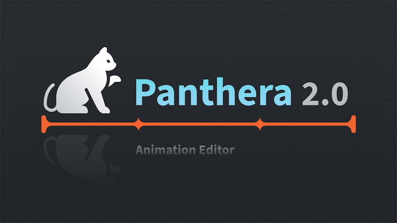

  

# Panthera 2.0 Editor

**Panthera 2.0 Editor** is a cross-platform animation software solution developed using the [Defold](https://defold.com/) engine, with the goal of streamlining the process of designing layouts and animations for game projects.

Integrated tightly with Defold, Panthera allows the import of `.gui` files, which can then be animated directly within the editor interface. This tool offers support for various animation techniques, including tweening, triggering, events, and animation keys, allowing users to create complex animations effortlessly.

**Panthera 2.0 Editor** uses a simple animation [JSON format](/docs_editor/animation_data_format.md) for animation files. If you are not using Defold, the animation runtime can be easily implemented in any game engine or framework.

## Features

- **Intuitive Layout Creation**: Design and arrange your scene elements effortlessly.
- **Advanced Animation Tools**: Craft smooth and complex animations to bring your game to life.
- **Simple Animation Format**: Export animations in a simple [JSON format](/docs_editor/animation_data_format.md) for easy integration into your projects.
- **Compact Size**: Lightweight and easy to install, with no additional dependencies required.
- **Defold Tight Integration**: Seamlessly import **Defold** `*.gui` files for direct animation within the editor.

## Animation Editor Features

- **Tween Keys**: Create tween animation keys to animate number properties over time, like `position`, `rotation`, `scale` and `color`.
- **Trigger Keys**: Create trigger animation keys to change non-number properties at a specific time, properties like `pivot`, `enabled`, `image` and `text`.
- **Event Keys**: Create event animation keys to trigger custom events at specific times like `play sound` or `start spine animation`. Event keys can have a duration and easing functions.
- **Animation Keys**: Create animation keys to run included animations at specific times. Animation keys can have a duration and easing functions.
- **Easing Functions**: Choose from a variety of easing functions to add smooth transitions to your animations.
- **Animation Blending**: Blend multiple animations simultaneously to create complex, layered animations.
- **Fast Loading**: Load project files swiftly to dive into animation creation without delay.

## Download

Get the latest release of **Panthera 2.0 Editor** from the [Releases](https://github.com/Insality/panthera/releases) page.

## Getting Started Guide

**Panthera 2.0 Editor** is designed to be user-friendly, with a focus on enhancing the animation workflow within Defold projects. To get started, visit the [Getting Started](getting_started.md) guide to learn the basics.

## License

This project is licensed under the Distribution License. For full details, please see the [LICENSE](LICENSE) file.

## Issues and Suggestions

Encounter a bug or have a feature request? Please [create an issue](https://github.com/Insality/panthera/issues) on GitHub to help improve **Panthera 2.0 Editor**.

## ❤️ Support the Project ❤️

Your support motivates me to keep creating and maintaining various projects. Consider supporting if you find my projects helpful and valuable.

  
